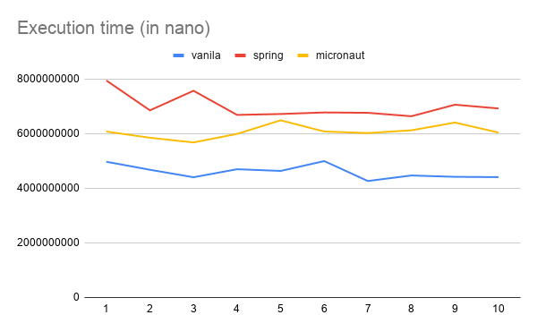

= Junit5-experiments

This repository contains several test applications based on Junit5 with vanilla Java/SpringBoot/Micronaut.

The goal is to compare 3 approaches for building Junit5 test application.

These test applications contain the same suite of simple tests and similar structure to make comparison more valid.

== Execution results

Each application was run 10 times in a row. Execution times are shown below:

Average execution time for this suite:

|===
|Approach |Average Time (nano)

|Vanilla Java
|4595609115

|Spring
|6994600674

|Micronaut
|6076568410
|===

As shown on chart, Vanilla Java shows the best execution time, then Micronaut and Spring with small difference.

